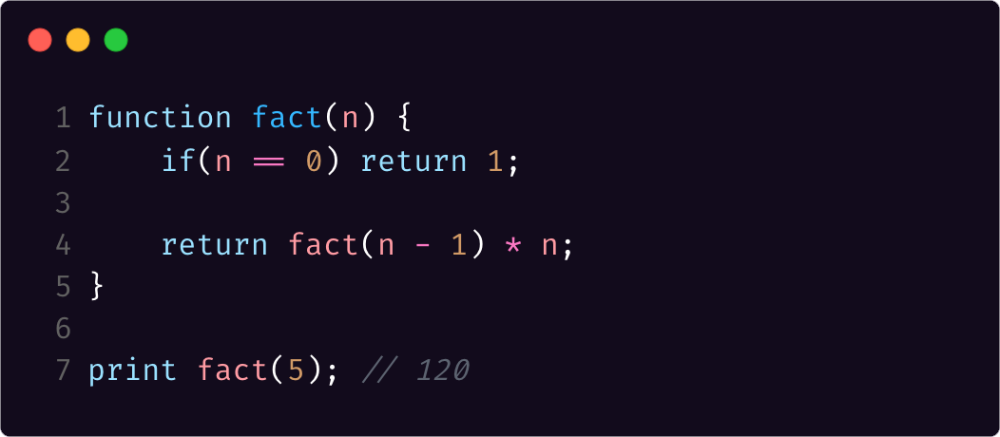

# Mint [](https://app.travis-ci.com/ice-bit/Mint) [](https://www.codefactor.io/repository/github/ice-bit/mint)

<div align="center">
    
</div>

Mint is a _tree-walking_ interpreter written in modern C++(>=17) for a subset of the Javascript programming language. The Mint interpreter is built using a simple _recursive descent_ parser. Mint shares a lot of functionalities with other high level programming languages, such as:
- Dynamic typing;  
- Support for basic arithmetical operations(`+`,`-`,`*`,`/`,`%`);  
- Basic control structures(such as _if-then-else_, _while_ and _for_);  
- Function declaration;  
- Function closures.  

The Mint interpreter is built following [Robert Nystrom's book: _"Crafting Interpreters"_](https://craftinginterpreters.com/).


## Building
Mint is written in modern C++ from scratch without using any additional library. In order to build it, you will need a modern C++ compiler(GCC, clang, MSVC, etc.) installed in your machine and a recent version of cmake(>= 3.12). Once installed, type the following commands(note: these instructions might not work under non-POSIX environments):
```sh
$> mkdir build && cd build
$> cmake ..
$> make
```

## Usage
```
Mint interpreter. Usage:
-f, --file [FILE]   | Run a Mint script
-a, --about         | About Mint
-h, --help          | Show this helper
Run Mint without parameters to open the REPL.
```
You can either use Mint by the interactive REPL or by providing a source file. Do note that the REPL does not supports statements splitted into multiple lines. You can find a complete list of supported programs into the `examples/` directory. Here some of them:
### FizzBuzz
```javascript
for(let i = 0; i <= 100; i = i + 1) {
    if((i % 3 == 0) and (i % 5 == 0)) print "FizzBuzz";
    else if(i % 3 == 0) print "Fizz";
    else if(i % 5 == 0) print "Buzz";
}
```

### Iterative Fibonacci
```javascript
let a = 0;
let b = 1;
let tmp = a + b;

for(let i = 0; i < 19; i = i + 1) {
    print tmp;
    a = b;
    b = tmp;
    tmp = a + b;
}
```

### Recursive Fibonacci
```javascript
function fib(n) {
    if(n <= 2) return n;

    return fib(n - 2) + fib(n - 1);
}


for(let i = 0; i < 20; i = i + 1)
    print(fib(i));
```

### Factiorial
```javascript
function fact(n) {
    if(n == 0) return 1;

    return fact(n-1) * n;
}

print fact(5); // 120
```

### Closure
```javascript
function make_counter() {
    let count = 0;

    fn counter() {
        count = count + 1;
        return count;
    }

    return counter;
}

let i = 0;
let count = make_counter();

while(i < 5) {
    print count();
    i = i + 1;
}
```

### Project euler - problem #1
```javascript
let sum = 0;

for(let i = 0; i < 1000; i = i + 1) {
    if((i % 3 == 0) or (i % 5 == 0)) sum = sum + i;
}

print "The sum of all the multiples of 3 or 5 below 1000 is:";
print sum;
```

## Benchmarks
Mint is quite fast for a three-walking interpreter, below you can find a table with some benchmarks:
| Command                    | Description                                                           | Timing           |
|----------------------------|-----------------------------------------------------------------------|------------------|
| `Mint -f fibonacci_rec.js` | Computing the first 35 numbers of the Fibonacci sequence recursively. | 422.58s(7:03.72) |
| `Mint -f fibonacci_it.js`  | Computing the first 35 numbers of the Fibonacci sequence iteratively. | 3 ms             |
| `Mint -f factorial.js`     | Computing the factorial of 150 recursively.                           | 11 ms            |


# License
Copyright (c) Marco Cetica 2022 under MIT license. You can read the terms of the MIT license [here](https://choosealicense.com/licenses/mit/).  
